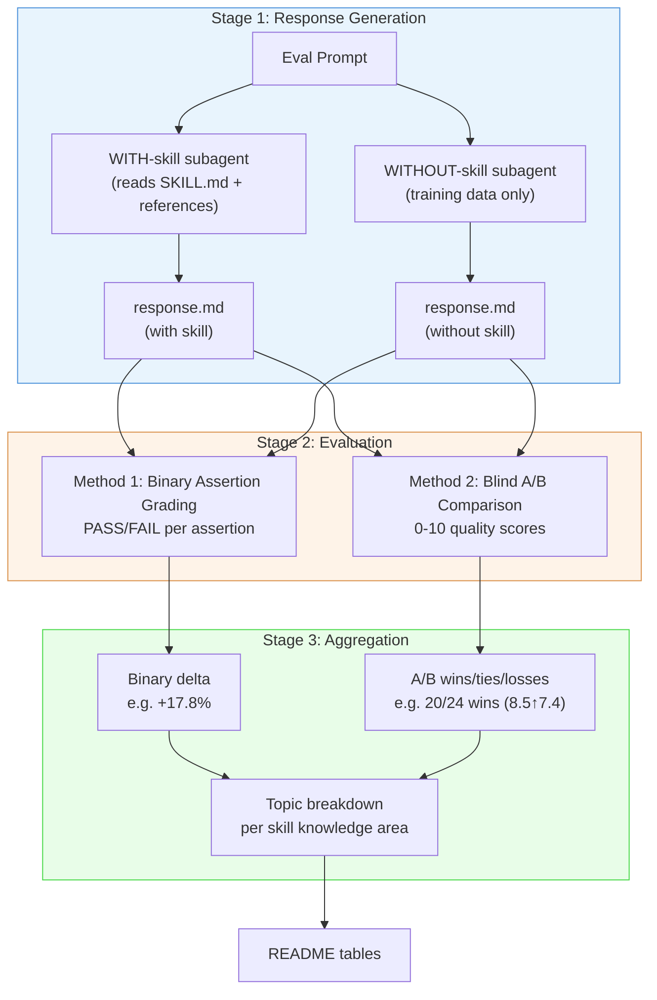
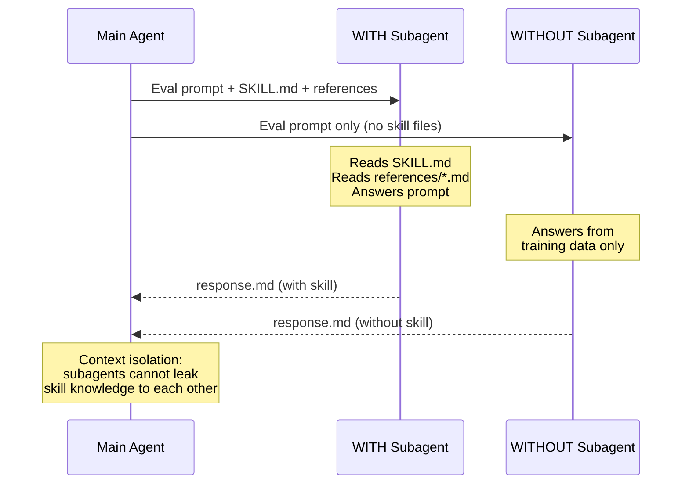
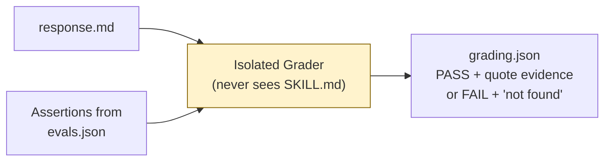
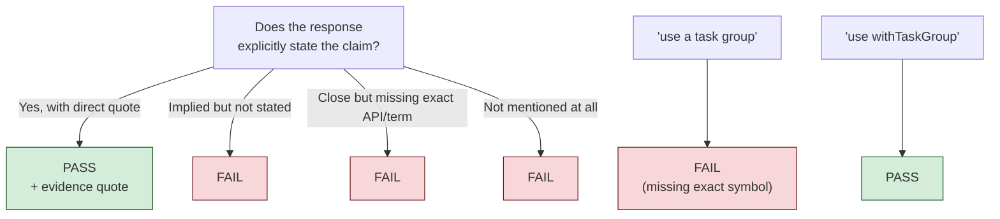
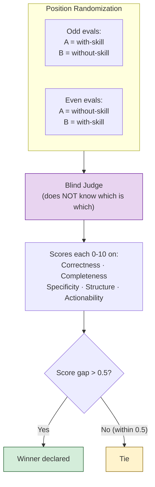
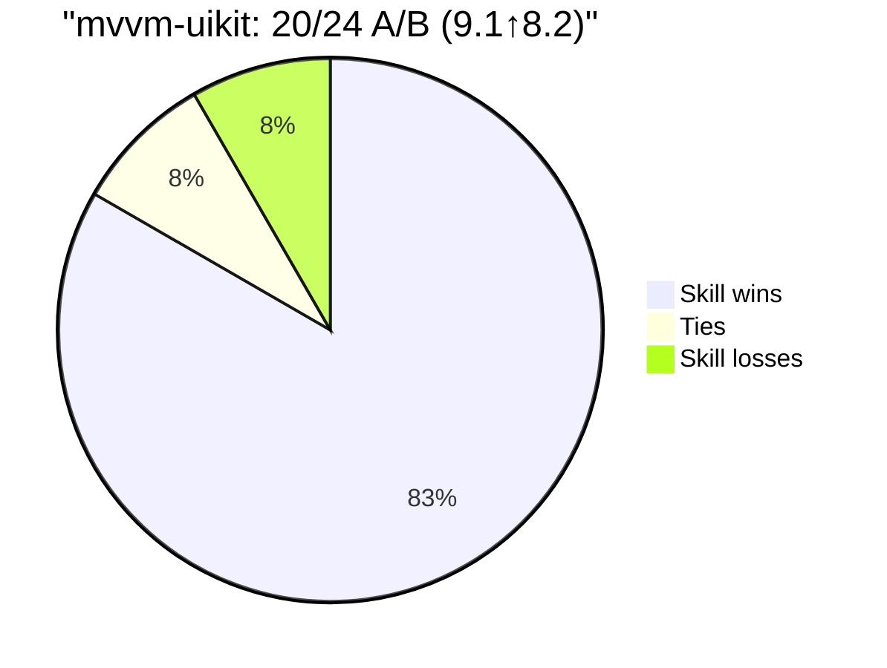
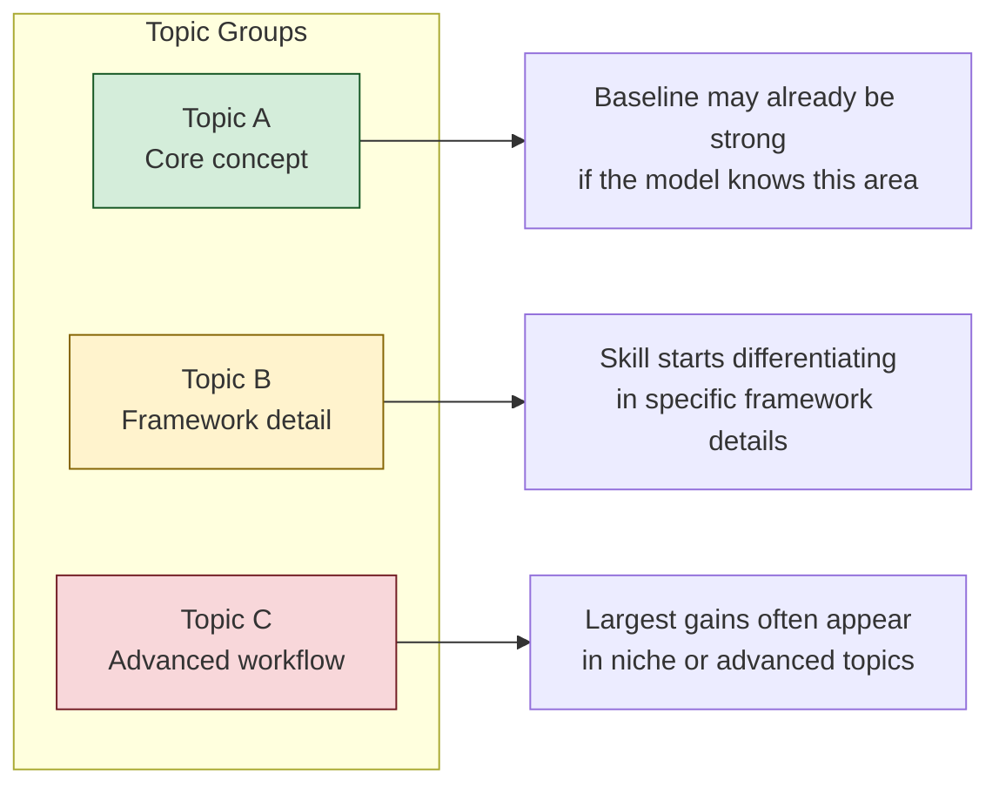
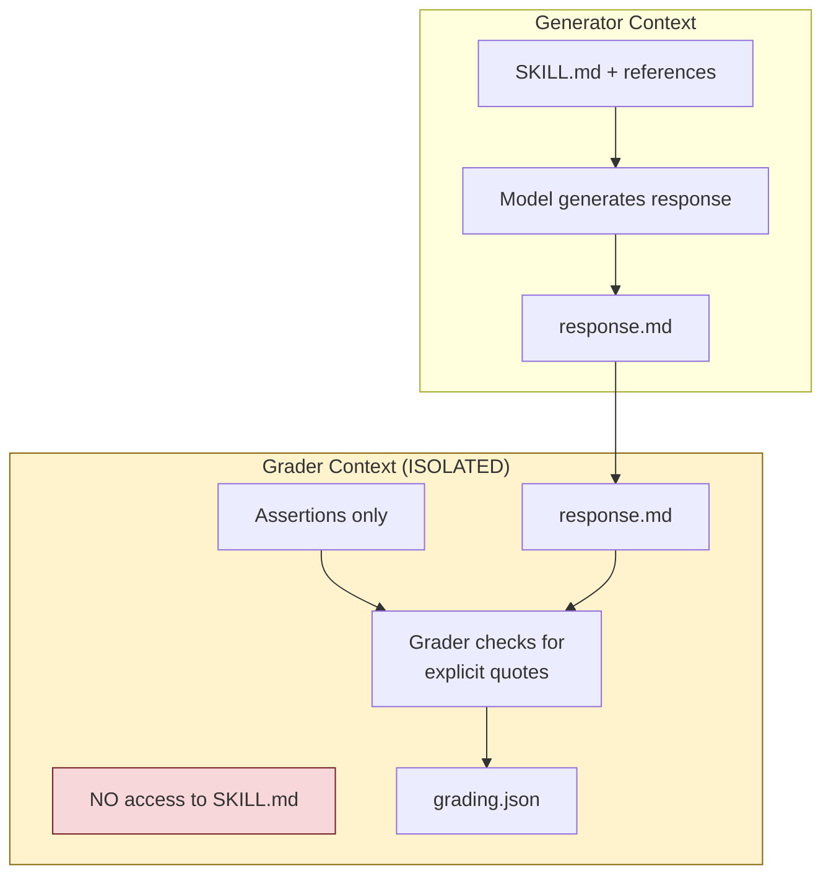
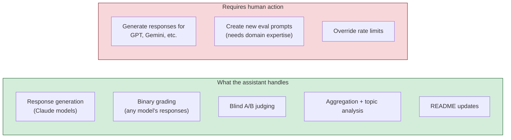
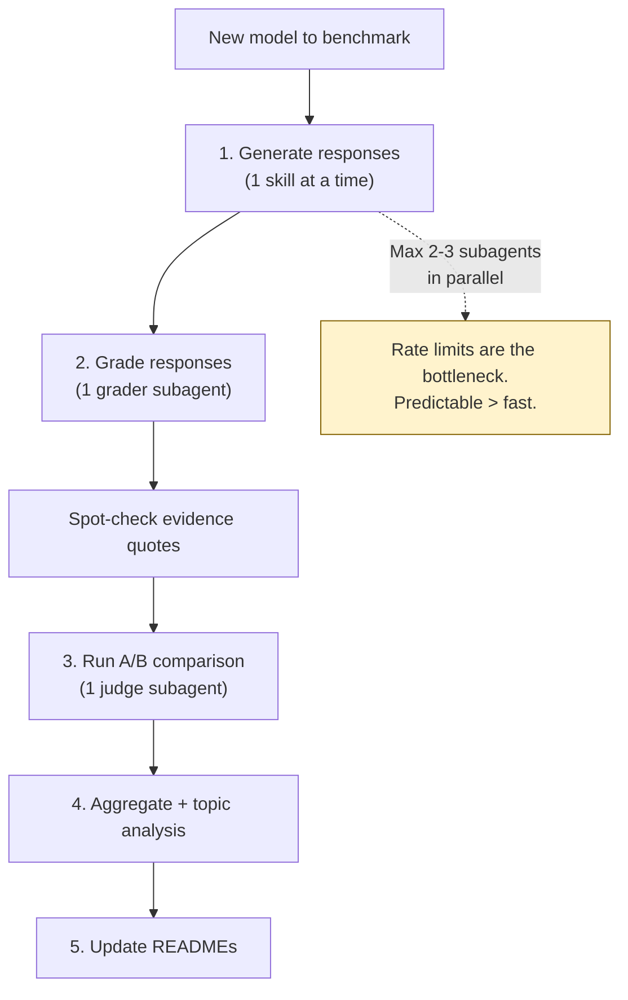

# Benchmarking Process — How It Works End-to-End

This document explains the full benchmarking process from the perspective of the AI assistant running it. It covers what happens at each stage, why each design decision exists, and what the assistant can and cannot do.

---

## Overview

The benchmarking system measures whether a skill makes an AI model's responses better for the specific task the skill was built for.

---

## Stage 1: Response Generation

### Why subagents, not the main agent

Each subagent has an **isolated context window**. The WITH subagent cannot "leak" skill knowledge to the WITHOUT subagent. If the main agent answered both, it would have skill knowledge in context when answering the WITHOUT variant — contaminating the baseline.

### What requires human action

Generating responses for non-Claude models (GPT, Gemini, etc.) — these must be generated externally and placed manually at the workspace paths.

---

## Stage 2: Method 1 — Binary Assertion Grading

### What it measures

Whether the response **explicitly states** specific technical claims.

### Grading rules — evidence only, no charity

### Why this strictness matters

1. **Reproducibility** — two graders given the same response produce the same score
2. **No inflation** — vague responses don't get credit
3. **Real signal** — the delta only appears when the skill teaches something concrete

### Limitations

Binary assertions cannot tell the difference between a one-line mention and a full explanation with code. Both score PASS. This is why Method 2 (A/B) exists.

---

## Stage 3: Method 2 — Blind A/B Quality Comparison

### What it measures

Which response is **qualitatively better** — deeper, more structured, more actionable.

### How to read A/B results

- **20/24** = skill response won 20 blind comparisons
- **Ties** = both responses equally good (score gap ≤ 0.5)
- **Losses** = without-skill was genuinely better (rare — 2 out of 132 total across all skills)
- **(9.1↑8.2)** = average scores: with-skill 9.1, without-skill 8.2

### Why A/B matters more than binary for strong models

For models that pass 95-100% of binary assertions at baseline (Sonnet 4.6), the binary delta is near zero. But A/B reveals quality differences invisible to pass/fail:

- Structured severity rankings
- Specific API references and code examples
- Edge cases and migration paths
- Organized findings with clear remediation steps

---

## Stage 4: Aggregation and Topic Analysis

Evals are grouped by topic. This shows WHICH knowledge areas the skill improves:

---

## Grading Integrity — Why It's Model-Agnostic

### Why the grading is trustworthy

1. **Evidence-based, not opinion-based** — the grader checks for explicit quotes, not whether the response "feels right"
2. **The grader never sees the skill** — it cannot know what the "expected" answer is
3. **Same grader for both variants** — any bias affects WITH and WITHOUT equally, so the delta is unbiased
4. **A/B cross-validates** — if binary grading were charitable, A/B would show all ties. Instead it shows clear winners
5. **Verifiable** — every PASS includes a direct quote anyone can check

### When to add harder assertions

If a new model passes 95%+ at baseline, the assertions were designed for a weaker model. The correct response:
- Keep running A/B (this always discriminates)
- Optionally: add deeper assertions testing specific API signatures or multi-step reasoning

---

## What the Assistant Can Do

---

## Recommended Workflow

**Key lesson:** Never run more than 2-3 subagents in parallel. Predictable sequential execution beats fast parallel execution that hits limits and produces zero results.
